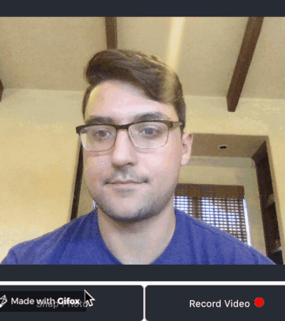

## Facial Verification Log-in Chrome Extension
Extension to enable facial verification for account login within your Chrome browser. Supply your siamese model with a short video recording and enjoy a "Face ID" kind of authentication right in your browser!  

## Motivation
I thought of creating this extension after first witnessing the iPhone X's Face ID feature first hand. Having an interest in computer vision I was amazed with being able to use your face as a way to sign in. When thinking about my day-to-day, I was constantly using/forgetting passwords while browsing the internet, so this seemed like a great project to take on

 
## Screenshots

**Introduce your facial features to the model for later verification:**


**Verification:**



## Tech/framework used

- [React](https://reactjs.org/)
- [Keras](https://keras.io)
- [OpenCV](https://opencv.org/)
- [Tensorflow](https://www.tensorflow.org/)
- [Flask](https://www.fullstackpython.com/flask.html)
- [Chrome API](https://developer.chrome.com/extensions/api_index)
- [Chrome Extensions](https://developer.chrome.com/extensions)

## Packages:
- [Base64](https://docs.python.org/3/library/base64.html)
- [Numpy](https://numpy.org/)
- [PIL](https://www.pythonware.com/products/pil/)
- [Axios](https://www.npmjs.com/package/axios)
- [Papaparse](https://www.npmjs.com/package/papaparse)


## Features

- Facial verification
- Facial descriptor via siamese model
- Automatically applies username and password to logins


## Installation

1. `pip install` **and** `npm install` **all relevant packages (listed above in tech/frameworks)**

2. **Grab your Chrome Passwords by exporting it to CSV (reference below link)**

  * https://www.cyclonis.com/how-export-passwords-csv-file-from-google-chrome/ 

3. **Put Chrome Passwords CSV into src folder**

4. **Go to ./server/flask_server.py and add your name**

```python

person = 'user' # replace with your name
model = None # do not change
graph = None # do not change

```

4. **Go to ./src/App.js and update the Chrome Passwords csv path for the variable data**
```javascript
/*global chrome*/
import React from 'react';
import './App.css';
import axios from 'axios';
import data from 'insert_chrome_passwords_csv_here';
import Papa from 'papaparse';
var t;
var mediaRecorder;
```

## Usage

1. After installation, go to main directory of the repo and run "npm run build" in terminal to create the build folder (used for extension uploading)

2. Type "chrome://extensions/" in your browser and click "load unpacked" in the top left and select that build folder from step 1

3. Navigate to ./server and type `export FLASK_APP=flask_server.py` in the terminal

4. Start Flask server by typing `flask run` in terminal

5. Train the Neural Network by clicking "Record" to record a video of you, then press "train model"; **You should receive a message saying model is successfully trained**

6. Go to a website that your chrome browser has saved the passwords for, then open up extension and take a photo. Click "verify user". If the model recognized you, your name should appear on top of the image and your user name and password should populate the login.

7. Congrats! You now can sign in with your facial features!!

## Contribute

Pull Requests are always welcome!

## Credits
Kara Chill, Pat Katsos, Louis Katsos for their faces during testing

## License

MIT © [Peter Katsos]()