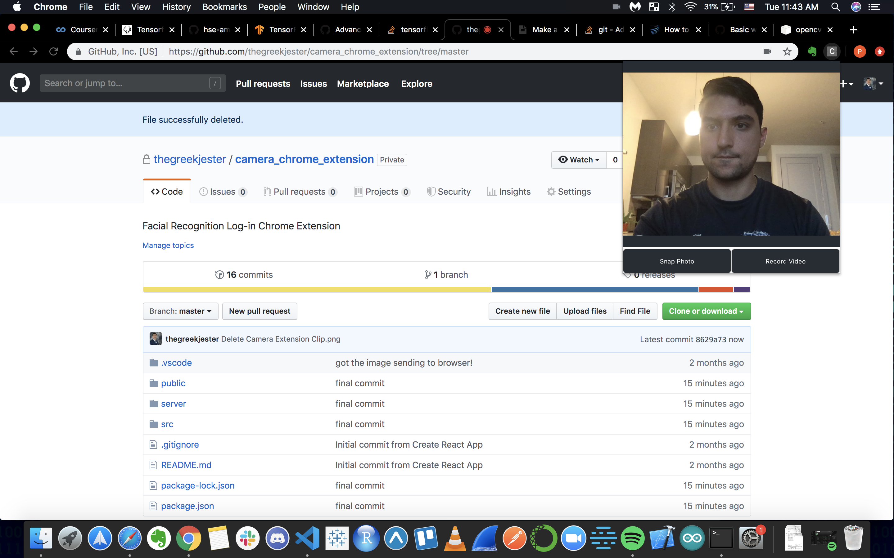

# Facial Recognition Chrome Extension

This is a chrome extension that you can use to sign in to websites with facial recognition. 



## Installation

For Python Part (the server)

```bash
pip3 install opencv-python

pip3 install flask 

pip3 install numpy
```

For JS part (front end)

```bash
npm install --save 
```

## Set up

1. **Grab your Chrome Passwords by exporting it to CSV**
  - https://www.cyclonis.com/how-export-passwords-csv-file-from-google-chrome/ 

2. **Put Chrome Passwords CSV into ./src folder**

3. **Go to ./server/flask_server.py and add your name**

```python
# localhost:5000/video route
@APP.route('/video', methods=['GET', 'POST'])
@cross_origin(supports_credentials=True)
def new_func():
    if request.method == 'GET':
        return 'Hello, World!'
    else:
        # uses request.files becuase what I am sending over is in blob format
        print('this is files', request.files['video'])
        file = request.files['video']
        file.save('new_output.webm')
        person = 'insert_name_here'
        video2dataset('new_output.webm',5,'dataset', person)
        train_faces('dataset', 'new_pickle.pickle', 'new_yml.yml')
        # send back a response saying training was succesfully 
        return 'received the video'

```

4. **Go to ./src/App.js and update the Chrome Passwords csv path for the variable data**
```javascript
/*global chrome*/
import React from 'react';
import './App.css';
import axios from 'axios';
import data from 'insert_chrome_passwords_csv_here';
import Papa from 'papaparse';
var t;
var mediaRecorder;
```

## Usage

1. **After Set up, run "npm run build" to create out the new build folder**

2. **Go to "chrome://extensions/" in your browser and upload the build folder you just created as a new extension**

3. **Go to ./server and run "export FLASK_APP=flask_server.py" in the terminal**

4. **Start Flask server by running "flask run" in terminal**

5. **Train the Neural Network by Capturing a video of you, then press "train model"; You should receive a message saying model is successfully trained**

6. **Go to a website that your chrome browser has saved the passwords for, then open up extension and take a photo. Then Click "keep photo". If the model recognized you, the user name and password should populate the login**

7. **Congrats! You now can sign in with your facial features!!**

 

## Contributing
Pull requests are welcome. For major changes, please open an issue first to discuss what you would like to change.

Please make sure to update tests as appropriate.

## License
[MIT](https://choosealicense.com/licenses/mit/)
